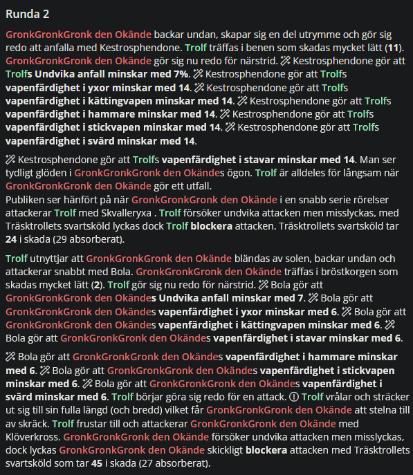
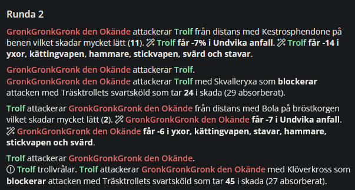
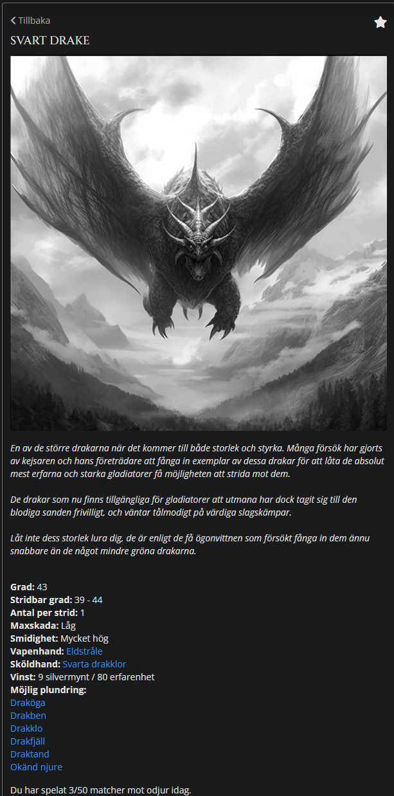
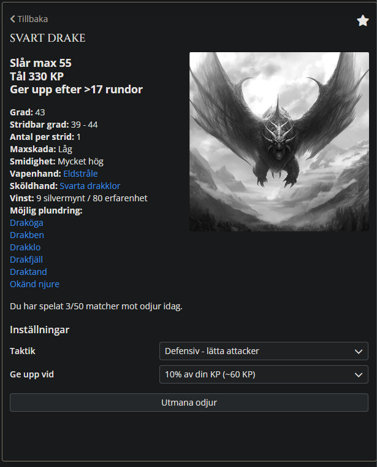

# lanista-plus

En Firefox extension som tweakar det härliga svenska webbspelet [Lanista](https://beta.lanista.se).

I dagsläget finns följande inställningar:
- Förenklat matchspråk
- Visa matchresultat överst
- Lägst grad först i utmaningar
- Visa detaljerad info om odjur
- Dölj beskrivning av odjur

Du kommer åt inställningarna genom att klicka på pusselikonen uppe till höger i Firefox, sen på Lanista Plus. Allt går slå på/av individuellt (som standard är allting påslaget).

### Hur installerar jag?

[Du hittar senaste release här](https://github.com/zopthemop/lanista-plus/releases), dra hem .xpi-filen under Assets och öppna den i Firefox. 

Funkar även i Firefox på Android, men då måste man pilla ytterligare, se [här](https://stackoverflow.com/a/79312694) (notera att tillägget är signerat, så man behöver bara följa steg 1 där).

Om Mozilla godkänner så läggs tillägget upp på https://addons.mozilla.org senare.

### Hörru, odjuret slog hårdare än den detaljerade infon sa!

Sorry för det, informationen är sammanställd av mig från [mitt stora Googledoc](https://docs.google.com/document/d/e/2PACX-1vTo9zVuv_y8akycy-dgyfPMO-9XELkwx_twDvUswjZQnUpgQp31waDJBjPBO9fs6gkrSvoYBcrXgtHe/pub#h.9lg1mxdjvml7). Om du blir slagen hårdare av ett odjur än vad den påstod var max, hör av dig till mig med matchen i fråga så uppdaterar jag informationen!

### Några enkla bildjämförelser nedan

Standard Lanista             |  Lanista Plus med "Förenklat matchspråk"
:-------------------------:|:-------------------------:
  |  

Standard Lanista             |  Lanista Plus med "Visa detaljerad info om odjur"  samt "Dölj beskrivning av odjur"
:-------------------------:|:-------------------------:
  |  
